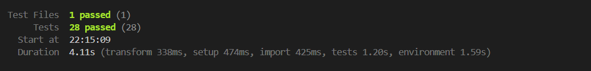
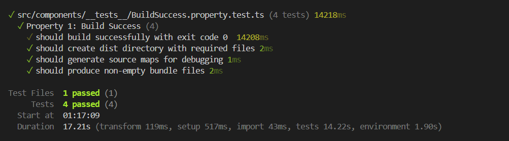
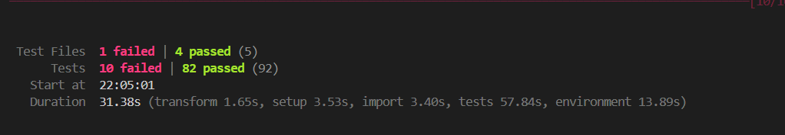
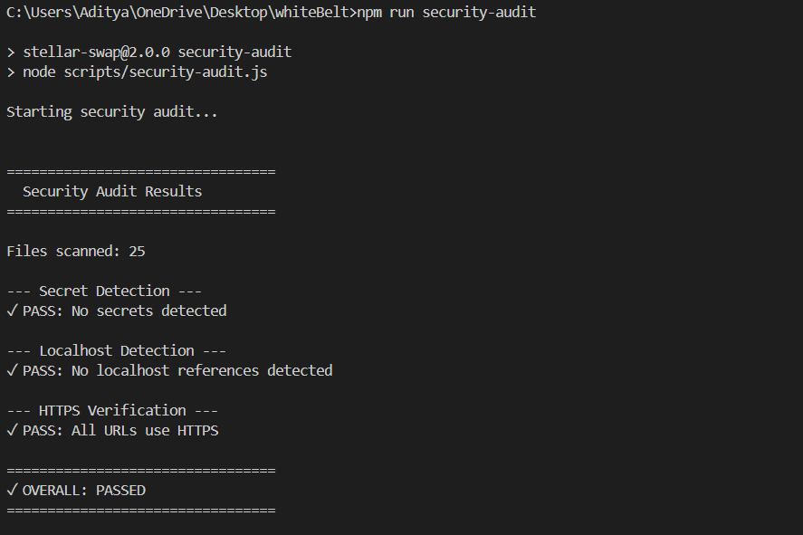
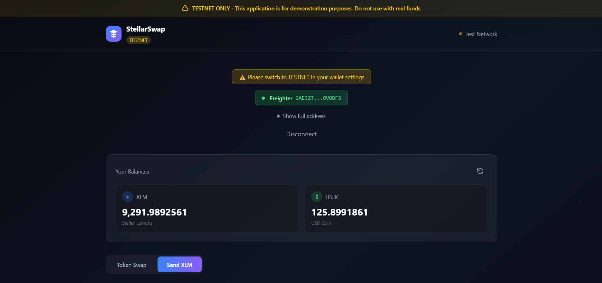
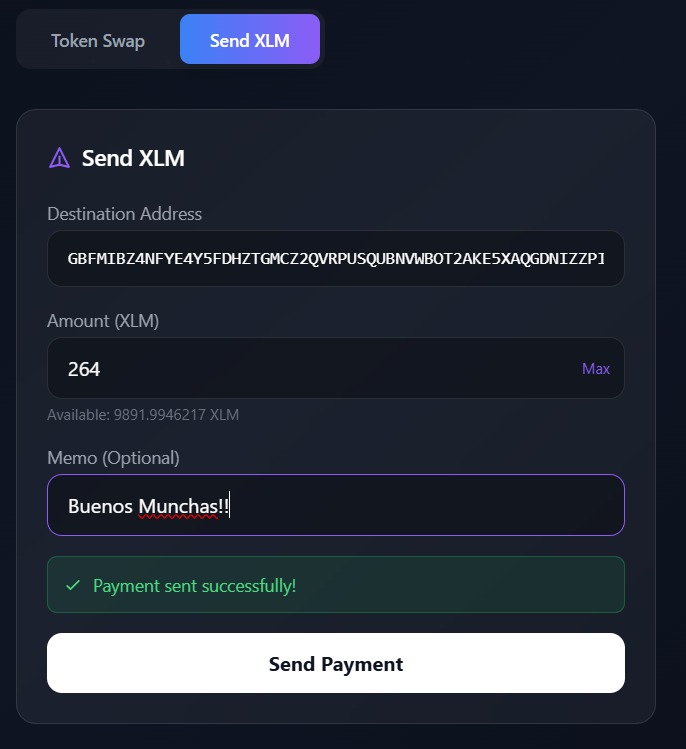
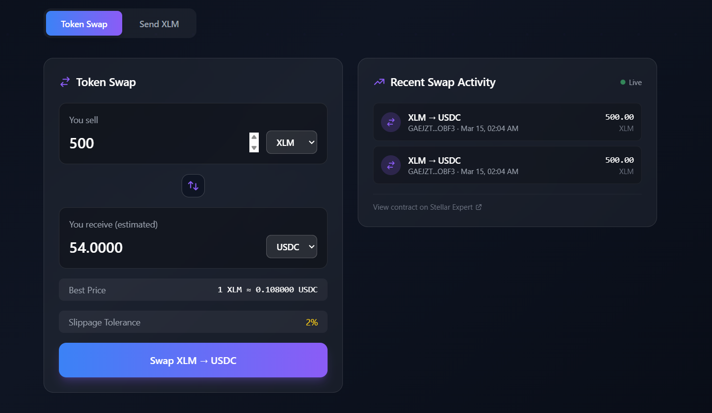

# StellarSwap

[](https://stellar.org)
[](https://github.com/stellar/js-stellar-sdk)
[](https://react.dev)
[](https://vitejs.dev)
[](https://www.typescriptlang.org)

---

## ⚠️ TESTNET ONLY - DEMONSTRATION APPLICATION

**This application is deployed on Stellar TESTNET for demonstration purposes only.**  
Do not use with Mainnet accounts containing real funds. All transactions use test XLM with no real-world value.

---

## Overview

StellarSwap is a production-style decentralized token swap interface built on the Stellar blockchain. It enables users to swap assets using Stellar's native DEX orderbook with instant settlement and minimal fees. The application integrates with popular Stellar wallets (Freighter, xBull) and tracks swap activity using a Soroban smart contract.

**Key Value Propositions:**
- **Instant Settlement** — Swaps execute in 3-5 seconds on Stellar's high-performance network
- **Minimal Fees** — Transaction costs are fractions of a cent
- **True Decentralization** — No intermediaries, no custody, your keys your crypto
- **Multi-Wallet Support** — Works with Freighter, xBull, and other Stellar-compatible wallets
- **On-Chain Tracking** — Soroban smart contract records swap metadata for transparency

**Target Audience:** Developers learning Stellar/Soroban, Stellar enthusiasts, dApp builders

## ✨ Features

- **Token Swapping via Stellar DEX** — Swap XLM, USDC, SRT, and other assets using Stellar's built-in decentralized orderbook (`manageSellOffer`)
- **Multi-Wallet Support** — Connect with Freighter, xBull, or other Stellar-compatible wallets via StellarWalletsKit
- **Real-Time Balance Display** — View your XLM and asset balances with automatic refresh
- **Swap Activity Tracking** — Soroban smart contract records swap metadata and emits events for real-time tracking
- **Live Swap Feed** — Real-time activity feed showing recent swaps from all users
- **XLM Payment Sending** — Send XLM to any Stellar address with memo support
- **TESTNET Network Detection** — Automatic detection and warning when connected to wrong network
- **Responsive UI** — Mobile-friendly interface built with Tailwind CSS
- **Transaction Lifecycle Tracking** — Full pending → success → failed status with explorer links
- **Live Price Preview** — Real-time orderbook pricing with estimated receive amounts

## 🏗 Architecture & Technology Stack

### Technology Stack

| Technology | Version | Purpose |
|------------|---------|---------|
| [React](https://react.dev/) | 18.3 | UI Framework |
| [TypeScript](https://www.typescriptlang.org/) | 5.6 | Type Safety & Developer Experience |
| [Vite](https://vitejs.dev/) | 5.4 | Build Tool & Development Server |
| [Tailwind CSS](https://tailwindcss.com/) | 3.4 | Utility-First Styling |
| [Stellar SDK](https://github.com/stellar/js-stellar-sdk) | 12.0 | Blockchain Integration & DEX |
| [StellarWalletsKit](https://github.com/nicecoder97/stellar-wallets-kit) | Latest | Multi-Wallet Management |
| [Soroban](https://soroban.stellar.org/) | Latest | Smart Contract Platform |
| [Vitest](https://vitest.dev/) | Latest | Testing Framework |

### High-Level Architecture

```
┌─────────────────────────────────────────────────────────────┐
│                     React Frontend (Vite)                   │
│  ┌──────────────┐  ┌──────────────┐  ┌──────────────┐       │
│  │ WalletConnect│  │  SwapForm    │  │ ActivityFeed │       │
│  │  Component   │  │  Component   │  │  Component   │       │
│  └──────┬───────┘  └───────┬──────┘  └────────┬─────┘       │
│         │                  │                  │             │
│         └──────────────────┼──────────────────┘             │
│                            │                                │
│  ┌─────────────────────────▼──────────────────────────────┐ │
│  │           Wallet Integration Layer                     │ │
│  │  (StellarWalletsKit + Freighter/xBull APIs)            │ │
│  └─────────────────────────┬──────────────────────────────┘ │
│                            │                                │
└────────────────────────────┼────────────────────────────────┘
                             │
        ┌────────────────────┼────────────────────┐
        │                    │                    │
        ▼                    ▼                    ▼
┌───────────────┐  ┌──────────────────┐  ┌──────────────────┐
│ Stellar SDK   │  │  Horizon API     │  │  Soroban RPC     │
│ (Transaction  │  │  (DEX Orderbook, │  │  (Smart Contract │
│  Building)    │  │   Account Data)  │  │   Interaction)   │
└───────┬───────┘  └────────┬─────────┘  └─────────┬────────┘
        │                   │                      │
        └───────────────────┼──────────────────────┘
                            │
                            ▼
                ┌───────────────────────┐
                │  Stellar TESTNET      │
                │  (Blockchain Network) │
                └───────────────────────┘
```

### Component Structure

- **`src/components/`** — React UI components (WalletConnect, SwapForm, Balance, etc.)
- **`src/wallet/`** — Wallet integration logic (StellarWalletsKit initialization)
- **`src/stellar/`** — Stellar SDK integration (DEX orderbook, transaction building)
- **`src/contract/`** — Soroban contract interaction (swap tracking)
- **`src/hooks/`** — React hooks (useWallet for state management)
- **`src/utils/`** — Utility functions (formatting, validation, constants)

### Key Dependencies

- **`@stellar/stellar-sdk`** — Core Stellar blockchain interaction
- **`stellar-wallets-kit`** — Unified wallet connection interface
- **`@stellar/freighter-api`** — Freighter wallet integration
- **`@creit.tech/stellar-wallets-kit`** — xBull wallet integration
- **`@testing-library/react`** — Component testing utilities
- **`vitest`** — Fast unit test runner with Vite integration

## 📋 Prerequisites

Before running StellarSwap locally, ensure you have:

1. **Node.js 18.x or later** — [Download from nodejs.org](https://nodejs.org/)
2. **npm or yarn** — Comes with Node.js (npm) or [install yarn](https://yarnpkg.com/)
3. **Stellar wallet browser extension:**
   - [Freighter](https://freighter.app) (recommended) — Chrome, Firefox, Edge
   - [xBull](https://xbull.app) (alternative) — Chrome, Firefox
4. **TESTNET account with XLM** — Get free test XLM from [Friendbot](https://laboratory.stellar.org/#account-creator?network=test)

### Getting TESTNET XLM

1. Install a Stellar wallet extension (Freighter or xBull)
2. Create a new wallet or import existing one
3. **Switch to TESTNET** in wallet settings
4. Copy your public key (starts with `G...`)
5. Visit [Stellar Laboratory](https://laboratory.stellar.org/#account-creator?network=test)
6. Paste your public key and click "Get test network lumens"
7. Your account will be funded with 10,000 test XLM

## 🚀 Setup Instructions

### 1. Clone the repository

```bash
git clone https://github.com/aditya-17-eth/Stellar-Simple-Payment-dApp
cd stellar-swap
```

### 2. Install dependencies

```bash
npm install
```

### 3. Start the development server

```bash
npm run dev
```

The application will start at `http://localhost:5173`

### 4. Configure your wallet

1. Open your Stellar wallet extension (Freighter or xBull)
2. **Switch to TESTNET** (critical step!)
3. Ensure your account has test XLM (see Prerequisites section)

### 5. Connect and swap

1. Click "Connect Wallet" in the application
2. Select your wallet (Freighter or xBull)
3. Approve the connection in the wallet popup
4. Select assets and enter swap amount
5. Click "Swap" and approve the transaction

## 📜 Smart Contract Information

### Deployed Contract (TESTNET)

- **Network:** Stellar TESTNET
- **Contract Address:** `CBEWIQV4KSH4KXA5V7B5ELMQM7WY7JTCTHB5DEPEFVJRLL62FGMJULOY
`  

### Contract Functions

The Swap Tracker contract provides the following functions:

| Function | Parameters | Description |
|----------|------------|-------------|
| `record_swap` | `user: Address, from_asset: String, to_asset: String, amount: String, timestamp: u64` | Records a swap event on-chain and emits an event |
| `get_recent_swaps` | `count: u32` | Returns the last N swap records |
| `get_swap_count` | None | Returns the total number of recorded swaps |

### Example Transactions

**Swap Contract Invocation:**
- Transaction Hash: `874ecebaf675797ed6f7a5413ef056fc3fa763ef5c992da183183abad609786a`
- View on Stellar Expert: [https://stellar.expert/explorer/testnet/tx/874ecebaf675797ed6f7a5413ef056fc3fa763ef5c992da183183abad609786a](https://stellar.expert/explorer/testnet/tx/874ecebaf675797ed6f7a5413ef056fc3fa763ef5c992da183183abad609786a)

### Verifying Contract on Stellar Expert

1. Visit [Stellar Expert TESTNET](https://stellar.expert/explorer/testnet)
2. Search for the contract address: `CBEWIQV4KSH4KXA5V7B5ELMQM7WY7JTCTHB5DEPEFVJRLL62FGMJULOY
`
3. View contract invocations, events, and storage
4. Verify swap records are being stored correctly

### Building & Deploying the Contract

If you need to redeploy the contract:

```bash
# Navigate to contract directory
cd contracts/swap_tracker

# Build the contract
cargo build --target wasm32-unknown-unknown --release

# Deploy to TESTNET
stellar contract deploy \
  --wasm target/wasm32-unknown-unknown/release/swap_tracker.wasm \
  --network testnet \
  --source YOUR_SECRET_KEY

# Update the contract ID in src/utils/constants.ts
```

## 🧪 Testing

StellarSwap uses Vitest for fast, reliable testing with both unit tests and property-based tests.

### Running Tests

```bash
# Run all tests once
npm test

# Run tests in watch mode (re-runs on file changes)
npm test -- --watch

# Run tests with coverage report
npm test -- --coverage

# Run tests with UI (interactive test explorer)
npm run test:ui
```

## 📚 Resources

### Stellar & Soroban Documentation

- [Stellar Documentation](https://developers.stellar.org/) — Official Stellar developer docs
- [Soroban Documentation](https://soroban.stellar.org/) — Smart contract platform docs
- [Stellar SDK Reference](https://stellar.github.io/js-stellar-sdk/) — JavaScript SDK API reference
- [Stellar Protocol](https://github.com/stellar/stellar-protocol) — Core protocol specifications

### Tools & Explorers

- [Freighter Wallet](https://www.freighter.app/) — Browser extension wallet
- [xBull Wallet](https://xbull.app/) — Alternative browser wallet
- [Stellar Laboratory](https://laboratory.stellar.org/) — Interactive transaction builder
- [Stellar Expert](https://stellar.expert/) — Blockchain explorer and analytics
- [Friendbot](https://laboratory.stellar.org/#account-creator?network=test) — TESTNET XLM faucet

### Community & Support

- [Stellar Discord](https://discord.gg/stellar) — Active developer community
- [Stellar Stack Exchange](https://stellar.stackexchange.com/) — Q&A for developers
- [Stellar GitHub](https://github.com/stellar) — Official repositories
- [Soroban Examples](https://github.com/stellar/soroban-examples) — Example smart contracts

### Learning Resources

- [Stellar Quest](https://quest.stellar.org/) — Interactive learning challenges
- [Soroban Quest](https://fastcheapandoutofcontrol.com/tutorial) — Smart contract tutorials
- [Stellar Developer Blog](https://www.stellar.org/developers/blog) — Latest updates and guides

## 🎬 Demo

### Live Demo

**Deployed Application:** `[Coming Soon]`

Once deployed, you can:
- Connect your TESTNET wallet
- Swap test assets (XLM, USDC, SRT)
- View real-time swap activity
- Send XLM payments

## Screenshots

**Test Output:**

- Shows all tests passing




- Swap test



- Security Audit



**Application Interface:**
- Home Screen

- Send XLM


- Token Swap


### Demo Video

**Video Walkthrough:** https://youtu.be/1DVpUVUDokM


---

## 🤝 Contributing

Contributions are welcome! To contribute:
- **Contract Address:** `CBEWIQV4KSH4KXA5V7B5ELMQM7WY7JTCTHB5DEPEFVJRLL62FGMJULOY`
2. Create a feature branch (`git checkout -b feature/new-feature`)
3. Make your changes
4. Run tests (`npm test`) and ensure they pass
5. Run build (`npm run build`) and ensure it succeeds
6. Commit your changes (`git commit -m 'Add new feature'`)
7. Push to the branch (`git push origin feature/new-feature`)
8. Open a Pull Request

Please ensure your code:
- Follows existing code style
- Includes tests for new functionality
- Updates documentation as needed
- Passes all existing tests

## 📄 License

This project is open source and available under the [MIT License](LICENSE).

---

**Built with ❤️ for the Stellar ecosystem**

