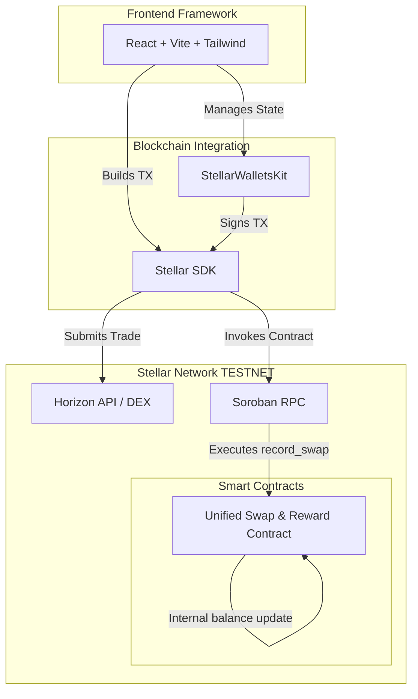
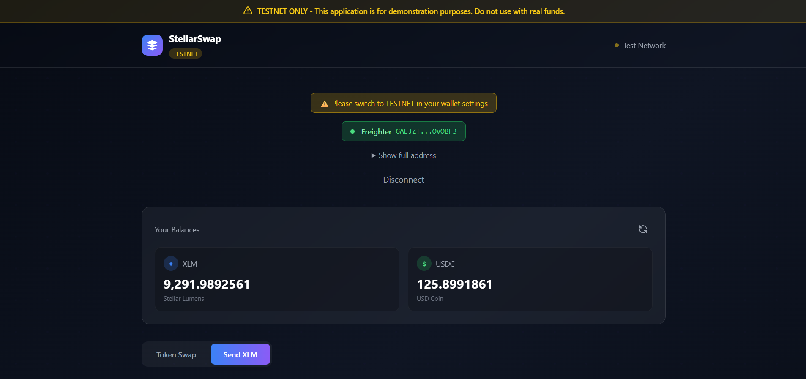
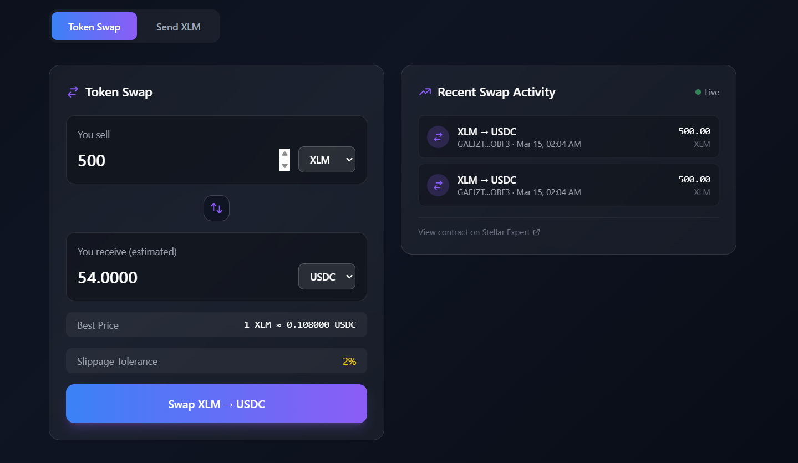
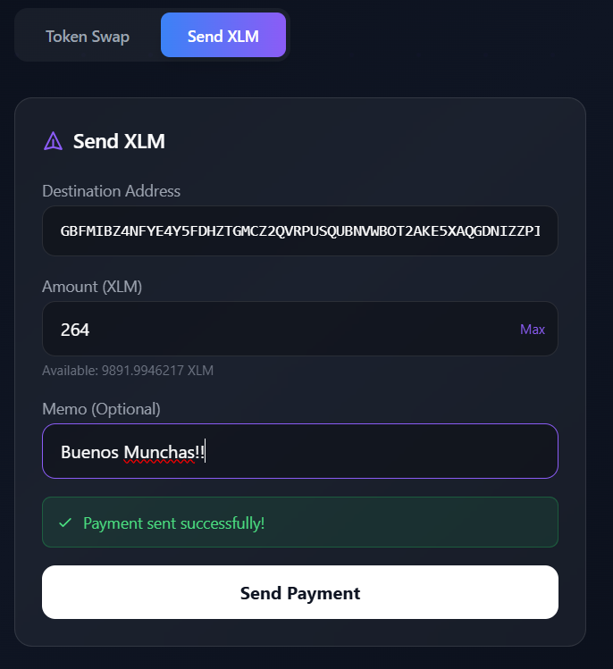
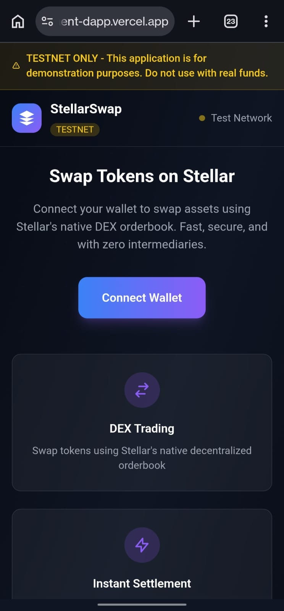
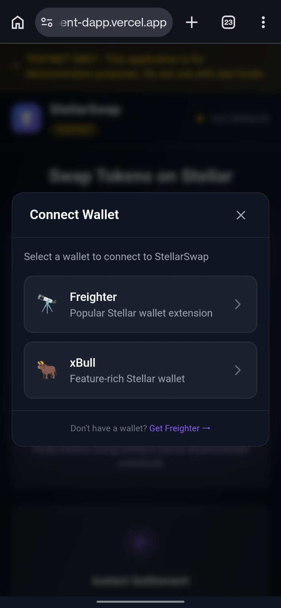
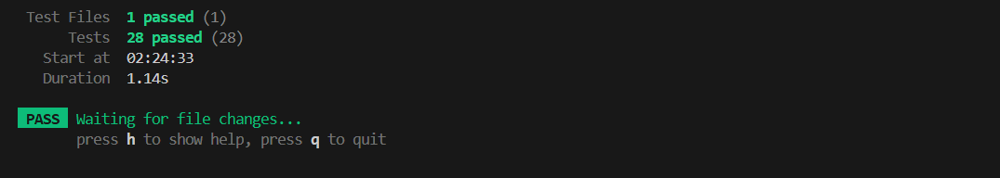
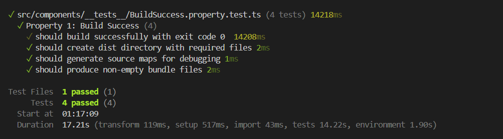
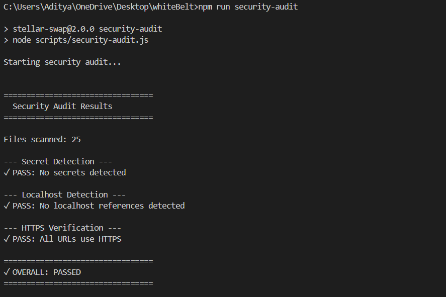

# StellarSwap

[](https://github.com/aditya-17-eth/Stellar-Simple-Payment-dApp/actions/workflows/ci.yml)
[](https://github.com/aditya-17-eth/Stellar-Simple-Payment-dApp/actions/workflows/contracts.yml)
[](https://stellar.org)
[](https://github.com/stellar/js-stellar-sdk)
[](https://react.dev)
[](https://vitejs.dev)
[](https://www.typescriptlang.org)

The seamless, decentralized token swap interface and multi-wallet gateway for the Stellar network.

## Live Demo

Experience the live application deployed on Vercel:
[https://stellar-simple-payment-dapp.vercel.app/](https://stellar-simple-payment-dapp.vercel.app/)

## Overview

StellarSwap is a production-ready decentralized application (dApp) built on the Stellar network that enables instant, low-fee token swaps directly via the native Stellar decentralized exchange (DEX). Designed with user experience in mind, it provides seamless multi-wallet connection, live price previews, and real-time transaction updates.

Furthermore, StellarSwap integrates an advanced Soroban smart contract architecture that features a native reward token system. Users automatically receive reward tokens directly to their wallets for every successful swap executed on the platform.

## Features

- **Multi-wallet connect/disconnect:** Universal compatibility with popular Stellar wallets including Freighter and xBull.
- **XLM swap execution:** Native order placement and fulfillment using Stellar's built-in DEX.
- **Reward tokens on swap:** Automated on-chain yield for platform users through Soroban contract orchestration.
- **Contract interaction from frontend:** End-to-end integration for submitting, simulating, and validating smart contract invocations.
- **Mobile responsive UI:** A finely tuned, adaptable interface engineered with Tailwind CSS for mobile and desktop consistency.
- **CI/CD pipeline:** Robust GitHub Actions configuration for automated frontend testing and continuous deployment, plus a dedicated Soroban contracts pipeline that builds WASM artifacts and runs on-chain unit tests.

## Architecture

StellarSwap utilizes a modern, modular architecture that bridges a high-performance frontend with secure on-chain Soroban smart contracts.


```mermaid
graph TD
    subgraph Frontend Framework
        UI[React + Vite + Tailwind]
    end

    subgraph Blockchain Integration
        StellarSDK[Stellar SDK]
        WalletKit[StellarWalletsKit]
    end

    subgraph Stellar Network TESTNET
        Horizon[Horizon API / DEX]
        Soroban[Soroban RPC]

        subgraph Smart Contracts
            Tracker[Unified Swap & Reward Contract]
        end
    end

    UI -->|Manages State| WalletKit
    UI -->|Builds TX| StellarSDK
    WalletKit -->|Signs TX| StellarSDK

    StellarSDK -->|Submits Trade| Horizon
    StellarSDK -->|Invokes Contract| Soroban

    Soroban -->|Executes record_swap| Tracker
    Tracker -->|Internal balance update| Tracker
```

## Smart Contracts

The platform relies on the following registered on-chain programs:

- **Network:** Stellar TESTNET
- **Swap Tracker Contract:** `CDWUBVLOPD6GWUQMRNOR5UMEEN4QTRFTHJEHAKVVXSJOTJYWEEUGR6FB`
- **Reward Token Contract:** `CDWUBVLOPD6GWUQMRNOR5UMEEN4QTRFTHJEHAKVVXSJOTJYWEEUGR6FB` (Unified)

## Application Interface







## Example Transactions

Review historical executions directly on the Stellar Expert block explorer:

- **Swap Transaction Hash:** `874ecebaf675797ed6f7a5413ef056fc3fa763ef5c992da183183abad609786a`
- **Contract Invocation Hash:** `874ecebaf675797ed6f7a5413ef056fc3fa763ef5c992da183183abad609786a`
- **View on Stellar Expert:** [https://stellar.expert/explorer/testnet/tx/874ecebaf675797ed6f7a5413ef056fc3fa763ef5c992da183183abad609786a](https://stellar.expert/explorer/testnet/tx/874ecebaf675797ed6f7a5413ef056fc3fa763ef5c992da183183abad609786a)

## Mobile Responsiveness

The application is thoroughly optimized for all device sizes, prioritizing a responsive design that guarantees performance and accessibility on mobile devices.





## Tech Stack

- **React:** UI Framework
- **Vite:** Build Tooling and Hot Module Replacement
- **Tailwind CSS:** Utility-first Styling
- **Stellar SDK:** Horizon API and Blockchain interactions
- **Soroban:** Smart Contract ecosystem for Stellar
- **Vitest:** High-speed Unit and Integration Testing
- **GitHub Actions:** CI/CD Automation

## CI/CD Pipelines

The project runs two independent GitHub Actions workflows to ensure quality across the entire stack:

| Workflow | Trigger | What it validates |
|---|---|---|
| **CI** (`ci.yml`) | Any push/PR to `main` | Installs Node.js dependencies, runs 80+ Vitest tests, and builds the production bundle. |
| **Contracts CI** (`contracts.yml`) | Any push/PR to `main` | Installs Rust + `wasm32` target, builds each Soroban contract to WASM via Stellar CLI, verifies artifacts, and runs `cargo test`. |

Both pipelines must pass before a pull request can be merged.


## Setup Instructions

Follow these steps to deploy the application locally:

1. **Clone the repository:**

   ```bash
   git clone https://github.com/aditya-17-eth/Stellar-Simple-Payment-dApp.git
   cd Stellar-Simple-Payment-dApp
   ```

2. **Install dependencies:**

   ```bash
   npm install
   ```

3. **Run the development server locally:**

   ```bash
   npm run dev
   ```

   The application will be accessible at `http://localhost:5173`.

4. **Run tests:**
   ```bash
   npm test
   ```

## Test Results

The application maintains a strict quality standard, backed by a comprehensive suite of over 80+ unit and integration tests. All core components and business logic are fully validated.





### Security Audit



## Demo Video

Watch a quick walkthrough of compiling, transacting, and interacting with StellarSwap:

[1-Minute Demo Video](https://youtu.be/1DVpUVUDokM)

## Resources

- [Stellar Documentation](https://developers.stellar.org/)
- [Soroban Smart Contracts](https://soroban.stellar.org/)
- [StellarWalletsKit Reference](https://github.com/creit-tech/Stellar-Wallets-Kit)
- [Stellar SDK Guide](https://stellar.github.io/js-stellar-sdk/)

---

